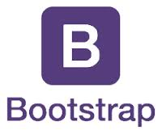

# Joel Legg's portfolio

## Overview

Joel Legg is a full stack software developer with a past in petroleum geology. His adventures have taken him around the world in the pursuit of discovering oil. His personal portfolio site includes information about him, technologies that he has worked with, and cool projects that he has been involved with. The website was built with React and is designed to be responsive for a visually pleasing display on any device.

## The tech

## The mockup

 

 

